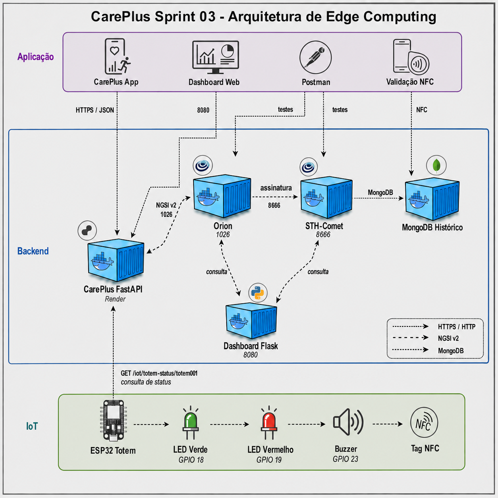

# CarePlus Sprint 03 - Edge Computing

Repositorio da entrega de Edge Computing da Sprint 03 do Challenge CarePlus.

A solucao usa o app CarePlus no celular para contar passos e validar a missao por NFC. O ESP32 representa o totem fisico, exibindo feedback com LED verde, LED vermelho e buzzer. O FIWARE/Orion/STH-Comet guarda o historico usado pelo dashboard web.

Aplicativo integrado:

https://github.com/UMKTO-CarePlus/careplus-sprint3-UMKTO

Simulacao Wokwi do ESP32:

https://wokwi.com/projects/463480006143988737

Imagem da arquitetura:



## Participantes

- RM566949 - Roger De Carvalho Paiva
- RM567855 - David Ernesto Mogollon Gama
- RM567680 - Pedro Henrique Tavares Viana

## Decisoes aprovadas

Para a arquitetura final apresentada ao professor:

- a API FastAPI hospedada no Render substitui o fluxo Node-RED;
- o prototipo fisico e um totem com ESP32, dois LEDs e buzzer;
- o pinout final usa LED verde no GPIO 18, LED vermelho no GPIO 19 e buzzer no GPIO 23.

## Estrutura

```text
iot/sprint03_hybrid_esp32/                 Firmware ESP32 simples para LED/buzzer
iot/sprint03_hybrid_esp32/diagram.json     Circuito Wokwi com 2 LEDs e buzzer
postman/CarePlus_Sprint03_Render_FIWARE.postman_collection.json
dashboard_web/app.py                       Dashboard web Flask na porta 8080
dashboard_web/careplus-dashboard.service   Modelo de servico Linux
docs/sprint03-render-fiware.md             Arquitetura, operacao e roteiro de teste
docs/evidencias/                           Fotos do prototipo fisico
INTEGRANTES.TXT
```

## Fluxo

```text
Celular/App CarePlus -> conta passos -> le tag NFC -> FastAPI no Render
FastAPI no Render -> status do totem
ESP32 fisico/Wokwi -> GET /iot/totem-status/totem001 -> LEDs + buzzer
FastAPI no Render -> Orion -> STH-Comet
Dashboard Flask :8080 -> STH-Comet :8666
```

## Execucao resumida

1. Subir a VM FIWARE do professor.
2. Importar a collection Postman.
3. Rodar os health checks de Render, Orion e STH-Comet.
4. No Postman, executar `1. Auth setup` para criar/logar usuario de teste e preencher `userId`.
5. No Postman, executar o fluxo do app: listar totens, iniciar missao, sincronizar passos e validar NFC.
6. Confirmar que a API sincronizou a entidade `CarePlusMission:totem001` no Orion.
7. Usar o ESP32 fisico ou simular o projeto no Wokwi: `https://wokwi.com/projects/463480006143988737`.
8. Usar os requests de feedback do Postman para testar `validating`, `success`, `error` e `idle` no ESP32.
9. Na VM, manter o STH-Comet em `8666`, liberar `tcp:8080` e acessar `http://34.69.120.192:8080`.
10. Conferir passos, distancia estimada, pontos e status no dashboard.

Detalhes completos em `docs/sprint03-render-fiware.md`.

## Video da entrega

Video publico da entrega:

https://youtu.be/UoN3zgkZmFk
