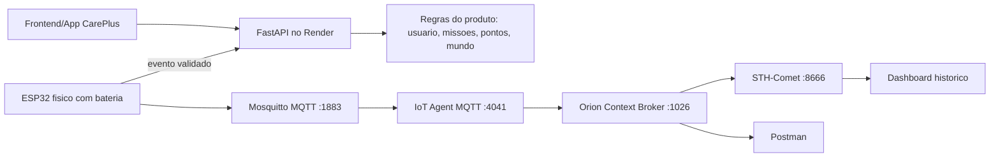

# CarePlus Sprint 03 - Render + FIWARE

Este documento descreve a arquitetura final de IoT mantendo o backend do CarePlus publicado no Render e adicionando a VM FIWARE do professor como camada oficial de Edge Computing.

## Arquitetura



## Papel de cada camada

### Render

O Render continua sendo a camada de produto do CarePlus. Ele hospeda o backend FastAPI usado pelo app para login, missoes, pontuacao, streak e evolucao do Mundo Ideal.

Endpoint principal usado pelo ESP32 no evento de validacao:

```http
POST https://careplus-sprint3-umkto.onrender.com/iot/token-collected
Content-Type: application/json
```

```json
{
  "device_id": "careplus-token-001",
  "event": "token_collected",
  "points": 50
}
```

Importante: esse endpoint espera que o usuario tenha iniciado a coleta pelo app antes. O fluxo correto e abrir a missao no app, iniciar a coleta e depois validar no ESP32.

### FIWARE

O FIWARE e a camada IoT academica da Sprint 03. Ele recebe a telemetria do ESP32, cria/atualiza entidade no Orion e persiste historico no STH-Comet.

Valores usados:

| Item | Valor |
|---|---|
| Orion | `http://35.198.7.130:1026` |
| IoT Agent MQTT | `http://35.198.7.130:4041` |
| STH-Comet | `http://35.198.7.130:8666` |
| Mosquitto MQTT | `35.198.7.130:1883` |
| FIWARE service | `openiot` |
| FIWARE service path | `/` |
| API key | `TEF` |
| Device ID FIWARE | `token001` |
| Entity ID | `CarePlusToken:token001` |
| IoT Agent resource | `/iot/d` |
| MQTT topic | `/TEF/token001/attrs` |

Payload UltraLight publicado pelo ESP32:

```text
s|tracking|p|0|st|12|ps|12|v|0|tp|0|b|99|r|-55|al|moderate|ax|0.21|ay|1.12|az|9.71
```

Mapeamento:

| Object ID | Atributo Orion |
|---|---|
| `s` | `state` |
| `p` | `pressCount` |
| `st` | `steps` |
| `ps` | `pendingSteps` |
| `v` | `tokenValue` |
| `tp` | `totalPoints` |
| `b` | `batteryLevel` |
| `r` | `rssi` |
| `al` | `activityLevel` |
| `ax` | `accelX` |
| `ay` | `accelY` |
| `az` | `accelZ` |

## Firmware

O firmware hibrido esta em:

```text
iot/sprint03_hybrid_esp32/sprint03_hybrid_esp32.ino
```

Ele faz duas coisas:

- publica telemetria periodica no FIWARE via MQTT;
- quando o botao valida uma missao, publica o evento no FIWARE e chama o Render com `POST /iot/token-collected`.

Antes de gravar no ESP32 fisico, ajuste:

```cpp
const char* ssid = "NOME_DA_REDE";
const char* password = "SENHA_DA_REDE";
const char* mqttServer = "IP_DA_VM_FIWARE";
const char* renderTokenCollectedUrl =
  "https://careplus-sprint3-umkto.onrender.com/iot/token-collected";
```

## Bateria

Para a apresentacao, a opcao mais segura e alimentar o ESP32 por um power bank USB 5V. Isso atende a demonstracao de autonomia de bancada por 2-4h com baixo risco.

Se usar Li-ion/LiPo, use modulo carregador/protecao e regulador adequado. Nao ligue uma celula Li-ion diretamente no pino 5V/3V3 sem regulagem correta.

O firmware reduz consumo evitando polling HTTPS constante. A telemetria normal e enviada a cada 30s, LEDs e buzzer so ligam em evento, e o display mostra apenas telas simples.

## Roteiro de teste

1. Ligar a VM FIWARE e subir containers do tutorial do professor.
2. Validar no Postman:
   - `GET http://35.198.7.130:1026/version`
   - `GET http://35.198.7.130:4041/version`
   - `GET http://35.198.7.130:8666/version`
3. Provisionar service e device no IoT Agent.
4. Iniciar a missao no app CarePlus publicado no Render.
5. Ligar o ESP32 e confirmar no Serial Monitor:
   - Wi-Fi conectado;
   - MQTT conectado;
   - payload publicado em `/TEF/token001/attrs`.
6. Gerar passos ou simular movimento e apertar o botao.
7. Confirmar no Serial Monitor:
   - publish FIWARE `validated`;
   - `POST` para Render com HTTP 2xx.
8. Consultar `CarePlusToken:token001` no Orion.
9. Consultar historico no STH-Comet.
10. Abrir dashboard e capturar prints para a entrega.

## Video de entrega

O video de ate 3 minutos deve mostrar:

- ESP32 fisico alimentado por bateria/power bank;
- Serial Monitor publicando MQTT e chamando Render;
- Postman consultando FIWARE;
- dashboard com historico;
- app CarePlus no Render refletindo a missao/pontuacao.
