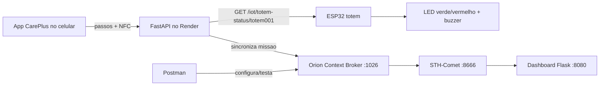

# CarePlus Sprint 03 - App NFC + FIWARE

Este documento descreve a arquitetura final de Edge Computing. O app CarePlus no celular conta passos, valida a missao por NFC e atualiza o backend no Render. O ESP32 funciona como totem de feedback fisico com dois LEDs e buzzer. O backend sincroniza a telemetria com o Orion, e o STH-Comet persiste o historico usado pelo dashboard.

O professor aprovou a API FastAPI no Render no lugar do Node-RED e o totem ESP32 no lugar do wearable descrito no enunciado geral.

## Arquitetura



## Backend Render

Endpoint consultado pelo ESP32:

```http
GET https://careplus-sprint3-umkto.onrender.com/iot/totem-status/totem001
```

Respostas esperadas:

```json
{
  "totemId": "totem001",
  "status": "success",
  "message": "Missao validada.",
  "updatedAt": "2026-05-11T10:30:00"
}
```

Mapeamento no ESP32:

| Status | Feedback |
|---|---|
| `success` | LED verde + buzzer de sucesso |
| `error` | LED vermelho + buzzer de erro |
| `validating` | LEDs verde/vermelho + bip curto |
| `idle` | LEDs apagados |

Endpoints usados no fluxo do app/Postman:

```text
POST /auth/register
POST /auth/login
GET  /totems
POST /missions/start
POST /missions/sync-steps
POST /missions/validate-nfc
GET  /iot/totem-status/{totem_id}
POST /iot/totem-feedback
```

## FIWARE e STH-Comet

Valores usados:

| Item | Valor |
|---|---|
| Orion | `http://34.69.120.192:1026` |
| STH-Comet | `http://34.69.120.192:8666` |
| FIWARE service | `openiot` |
| FIWARE service path | `/` |
| Entity ID | `CarePlusMission:totem001` |
| Entity type | `CarePlusWalkingMission` |

A entidade do dashboard usa estes atributos:

| Atributo | Tipo | Descricao |
|---|---|---|
| `steps` | Integer | Passos sincronizados pelo app/celular |
| `distanceMeters` | Number | Estimativa em metros |
| `distanceKm` | Number | Estimativa em km |
| `points` | Integer | Pontos da missao |
| `validationStatus` | Text | `idle`, `validating`, `success` ou `error` |
| `totemId` | Text | Totem usado na missao |
| `missionId` | Text | ID da missao |
| `userId` | Text | Usuario usado no teste |

A estimativa padrao e:

```text
distanceMeters = steps * 0.75
distanceKm = distanceMeters / 1000
```

## Firmware ESP32

O firmware esta em:

```text
iot/sprint03_hybrid_esp32/sprint03_hybrid_esp32.ino
```

Ele usa apenas:

```cpp
#include <HTTPClient.h>
#include <WiFi.h>
#include <WiFiClientSecure.h>
```

Pinos do diagrama Wokwi:

| Componente | GPIO |
|---|---|
| LED verde | `18` |
| LED vermelho | `19` |
| Buzzer | `23` |

Antes de gravar no ESP32 fisico, ajuste rede se necessario:

```cpp
const char* ssid = "NOME_DA_REDE";
const char* password = "SENHA_DA_REDE";
```

## Dashboard web

O dashboard dinamico esta em:

```text
dashboard_web/app.py
```

Ele roda uma pagina web e API local na porta `8080`, consumindo dados historicos do STH-Comet na porta `8666`.

Na VM, configure `STH_COMET_URL=http://127.0.0.1:8666` e publique somente o dashboard na porta `8080`.

Endpoints principais:

```text
GET /api/health
GET /api/entity
GET /api/history?lastN=100
GET /api/history/steps?lastN=100
GET /api/history/distanceMeters?lastN=100
```

Execucao local:

```bash
cd dashboard_web
python -m venv venv
source venv/bin/activate
pip install -r requirements.txt
python app.py
```

Acesse:

```text
http://localhost:8080
```

Na VM da entrega, apos liberar a porta `8080`, acesse:

```text
http://34.69.120.192:8080
```

Para liberar a porta na GCP, crie uma regra de firewall de entrada:

```text
Nome: careplus-dashboard-8080
Direcao: Entrada
Acao: Permitir
Alvos: VM FIWARE ou tag de rede da VM
Origem IPv4: 0.0.0.0/0
Protocolos e portas: tcp:8080
Prioridade: 1000
```

Se usar `gcloud`:

```bash
gcloud compute firewall-rules create careplus-dashboard-8080 \
  --direction=INGRESS \
  --priority=1000 \
  --network=default \
  --action=ALLOW \
  --rules=tcp:8080 \
  --source-ranges=0.0.0.0/0
```

## Roteiro de teste

1. Ligar a VM FIWARE e subir Orion/STH-Comet.
2. Importar `postman/CarePlus_Sprint03_Render_FIWARE.postman_collection.json`.
3. Executar `0. Health checks`.
4. Em `1. Auth setup`, executar `Register test user` e `Login test user`. Esses requests preenchem `userId` automaticamente para evitar o erro `Usuario nao encontrado`.
5. Em `2. App + NFC flow`, executar:
   - `List totems`;
   - `Start walking mission`;
   - `Sync steps from phone`;
   - `Validate NFC mission`;
   - `Get ESP32 totem status`.
6. Ligar o ESP32 fisico com LEDs nos GPIOs 18/19 e buzzer no GPIO 23. O Wokwi fica como alternativa de simulacao.
7. Em `3. ESP32 feedback demo`, alternar `validating`, `success`, `error` e `idle` para ver LEDs/buzzer.
8. Em `4. FIWARE + STH dashboard flow`, executar:
   - `Create dashboard entity`;
   - `Create STH-Comet subscription`;
   - confirmar a sincronizacao automatica do Render ou executar `Update FIWARE mission history` como fallback;
   - `Get dashboard entity keyValues`;
   - `Get STH steps history`;
   - `Get STH distance history`.
9. Subir o dashboard web com `python dashboard_web/app.py` ou com o servico `careplus-dashboard`.
10. Abrir `http://localhost:8080` dentro da VM ou `http://34.69.120.192:8080` externamente.

## Video de entrega

Video publico da entrega:

https://youtu.be/UoN3zgkZmFk

O video de ate 3 minutos mostra:

- app no celular iniciando/sincronizando a missao e validando NFC;
- ESP32 fisico acendendo LED verde e tocando buzzer quando o status fica `success`;
- Postman atualizando a entidade FIWARE;
- dashboard web na porta `8080` mostrando passos, distancia estimada, pontos e historico.
